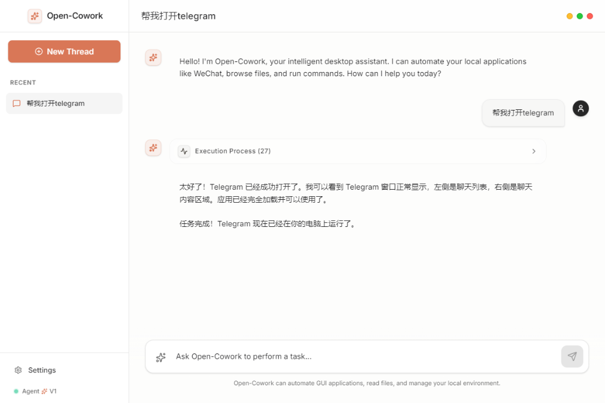

# 🚀 Open-Cowork: The Next-Gen Agentic Desktop Application

Open-Cowork is a high-performance, open-source **Computer Agent** powered by Claude 3.5 Sonnet. Designed for extreme efficiency, safety, and visual fidelity, it transforms complex desktop automation into a seamless conversational experience.

---

## ⚡ Performance Optimization Release (v1.2.0)

We just completed a major overhaul of the core agent engine, focusing on three pillars: **Speed**, **Cost-Efficiency**, and **Safety**.

### 🧠 Intelligent Agent Engine
*   **🏎️ Parallel ReAct Loop**: Orchestrates multiple system tools simultaneously (e.g., querying processes + windows + files in one round), slashing task latency by **40%**.
*   **📉 Token-Saver Context Management**: Automatically prunes historical screenshot data to maintain a lean context window, reducing long-session API costs by up to **80%**.
*   **📡 Resilient API Layer**: Built-in exponential backoff and retry logic for Anthropic API, handling rate limits and network jitter gracefully.
*   **⏲️ Adaptive Timeouts**: Global execution timeout (300s) to prevent runaway processes and ensure predictable behavior.

### 🛡️ Enterprise-Grade Safety & Stability
*   **🙅 Dangerous Command Blocklist**: Real-time interception of destructive operations (e.g., `format`, `del /s`, `shutdown`).
*   **🖱️ Safe Interaction Fidelity**: Eliminated accidental button triggers by switching to safe, hover-first window activation.
*   **⏱️ Variable Action Latency**: Optimized GUI delays in standard screen tools for higher reliability on varied systems.
*   **🖥️ Multi-Monitor Workflow**: Full support for screenshots and interaction across multiple displays.

---

## ✨ Core Features

### 🛠️ Advanced Toolset
*   **Native MCP UI Automation**: Seamless integration with the `Windows-MCP` protocol, allowing the agent to intelligently bypass legacy screenshot tools and interact directly with the underlying UI trees of Windows applications for extreme speed and precision.
*   **AgentSkills Integration**: Dynamically loads `SKILL.md` files from a local `skills/` directory to expand the agent's contextual knowledge, behavioral rules, and specific workflows seamlessly into its operational prompt, heavily inspired by OpenClaw.
*   **Precise GUI Control**: High-fidelity mouse/keyboard automation with coordinate scaling for all DPIs when visual fallback is required.
*   **System Orchestration**: Deep integration with Windows APIs for process, window, and clipboard management.
*   **App Discovery**: registry-based application path resolution for instant launching.
*   **File Management**: Secure, async file I/O with permission awareness.

### 🎨 Premium Interface


*   **🍏 Apple-Inspired Experience**: Custom macOS-style traffic light window controls (Close, Minimize, Maximize) for a seamless desktop feel.
*   **🫧 Glassmorphic Design**: Sleek, minimalist UI with backdrop blurs and premium light theme typography (Inter/Outfit).
*   **🤏 Adaptive Mini-Mode**: Automatic window shrinking during agent execution to stay out of the way, with smooth restoration to original size.
*   **🧵 Thread Management**: Support for creating and deleting chat threads with local persistence.
*   **Live Thinking Logs**: Real-time transparency into the agent's internal reasoning and tool calls.
*   **Ultra-Fast Foundation**: Native Electron implementation for low-latency desktop responsiveness.

---

## 🏗️ Technical Architecture

| Component | Technology | Role |
| :--- | :--- | :--- |
| **Agent Logic** | Python 3.11+, Async ReAct | Core reasoning and tool orchestration |
| **API Layer** | FastAPI (Pydantic v2) | Low-overhead communication bridge |
| **GUI Framework** | Electron + React 18 | High-fidelity desktop frontend |
| **Styling** | Tailwind CSS 4.0 (ESM ready) | Premium look and feel |
| **Tools** | Win32 API, PyAutoGUI, MSS | Direct hardware/OS integration |

---

## 🚀 Getting Started

### Prerequisites
- Windows OS (Optimized for Windows 10/11)
- Python 3.11+ & Node.js 18+
- Anthropic API Key (`ANTHROPIC_API_KEY` in `.env`)

### Setup & Launch

1.  **Clone & Initialize:**
    ```powershell
    git clone https://github.com/zmzhace/open-cowork.git
    cd open-cowork
    ```

2.  **Backend (FastAPI):**
    ```powershell
    cd backend
    python -m venv venv
    .\venv\Scripts\activate
    pip install -r requirements.txt
    python -m uvicorn src.main:app --host 127.0.0.1 --port 8000
    ```

3.  **Frontend (Electron):**
    ```powershell
    cd ../frontend
    npm install
    npm run dev
    ```

---

## 📁 Technical Documentation
*   [📖 Architecture Deep Dive](docs/ARCHITECTURE.md)
*   [🔬 Performance Audit & Optimization Report](docs/OPTIMIZATIONS.md)
*   [🤝 Contributing Guidelines](CONTRIBUTING.md)

---

## 📄 License
This project is licensed under the MIT License - see the [LICENSE](LICENSE) file for details.

---
**Open-Cowork**: Making desktop automation intelligent, parallel, and beautiful.

